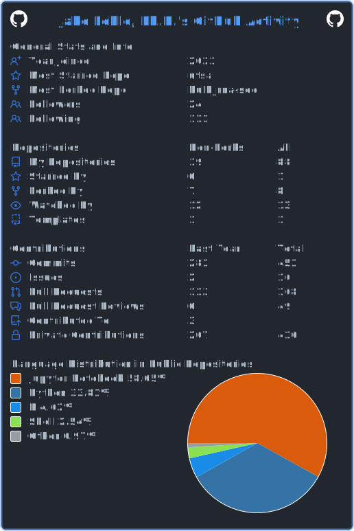

<h1 align="left">Hi , I'm Dr. Jake Lehle</h1>
<h2 align=left>  About me  </h2>
<b1 align=left> My focus is on bioinformatic pipeline development.
  My stable pipelines are pinned below and are updated weekly.
  I'm crruently working on agent based workflows.
</b1>

<h2 align=left> I’m happy to collaborate on  </h2>
<ul>
  <li>Bioinformatics pipelines including: scRNA-seq and virus detection</li>
  <li>Gene regulatory networks and machine learning</li>
</ul>

