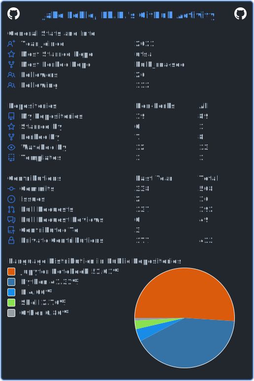

<h1 align="left">
  Hi , I'm Dr. Jake Lehle
</h1>

<table border="0">
  <tr>
    <td>
      
    </td>
    <td valign="middle">
      <h2>About me</h2>
    </td>
    <td>
      
    </td>
  </tr>
</table>

  I develop bioinformatics pipelines to make science easier for all. 
  My stable pipelines are pinned below and are updated weekly. 
  I'm currently working on agent-based workflows.

<h2 align=left> I’m happy to collaborate on  </h2>
<ul>
  <li>Bioinformatics pipelines including: scRNA-seq and virus detection</li>
  <li>Gene regulatory networks and machine learning</li>
</ul>

